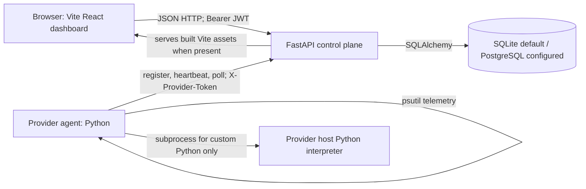
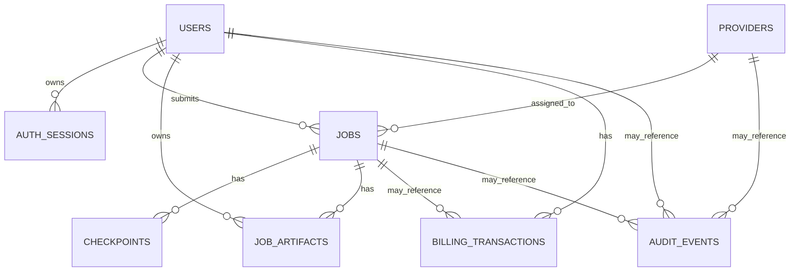
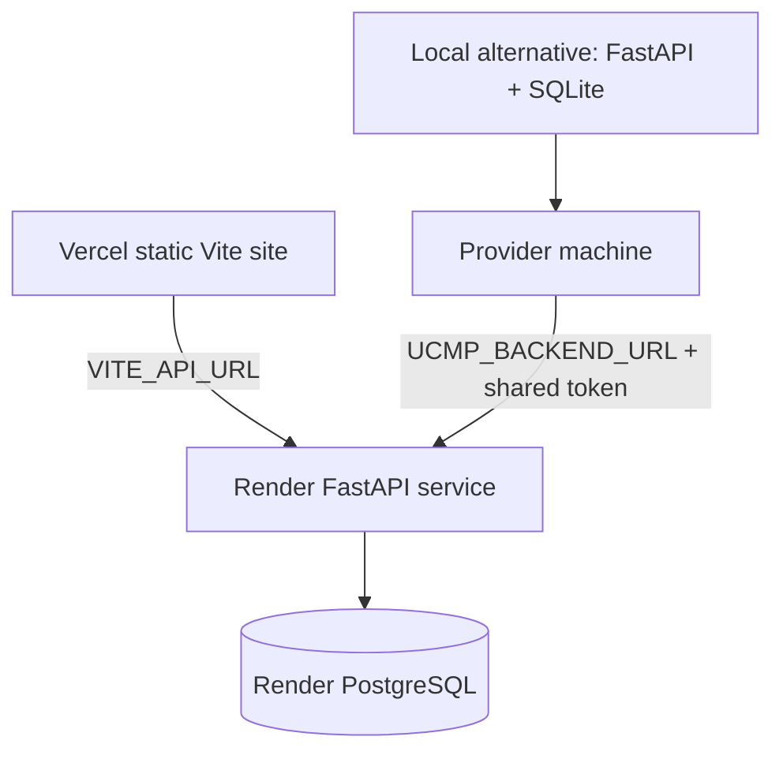

# Complete Technical Documentation

> **Evidence standard.** This document describes the checked-out implementation, principally `user-website/backend/app/main.py`, `provider-server/main.py`, and the Vite application under `user-website/frontend-vite-backup`. “Not implemented” means no corresponding runtime path was found. Existing files under `docs/` are not treated as authoritative where they conflict with code.

## 1. Project Overview

**Project:** Nexora — Unified Compute Management Platform (UCMP), version `0.1.0` in the FastAPI metadata.

**Purpose and users:** Nexora is a distributed-compute prototype for a developer/user who submits a small workload through a browser dashboard. A separately run provider agent polls the control plane, executes the workload on its own machine, and reports progress and a result. The primary use cases implemented are three synthetic CPU workloads (`matrix_multiply`, `prime_search`, `fibonacci`), submitted Python source, provider telemetry, job history/checkpoints, and demo wallet credit.

**Actual architecture:** React/Vite browser dashboard → FastAPI control plane → SQLite by default or PostgreSQL when `DATABASE_URL` is supplied. Provider machines run a Python polling agent using `requests` and `psutil`; the control plane does not call providers directly. There is no queue broker, worker platform, WebSocket/SSE connection, cloud object storage, ML service, or GPU scheduler.



### Status snapshot

| Area | Status | Evidence |
|---|---|---|
| Browser account registration/login | Implemented | `main.py:149-157`, Vite `src/App.jsx:3` |
| Provider registration, heartbeats and polling | Implemented | `main.py:160-172,198-206`; provider `main.py:12-16,62-65` |
| Scheduling and result persistence | Implemented | `main.py:115-117,175-182,207-223` |
| Checkpoint-based reassignment | Partially implemented | `main.py:118-137`; continuation is approximate for presets and unsafe/inaccurate for custom Python |
| Python workload execution | Implemented, unsandboxed | provider `main.py:42-50` |
| GPU execution/allocation | Not implemented | provider registers `gpu_name=None` and telemetry GPU `0` |
| Payment processing | Not implemented; demo top-up only | `main.py:239-245` |
| Next.js dashboard/auth templates | Configured but unused | root Vercel config and FastAPI select the Vite backup directory |

## 2. Technology Stack

| Technology | Actual use | Status |
|---|---|---|
| Python 3.12 image / Python runtime | Control plane and provider | Implemented (`Dockerfile`, Python source) |
| FastAPI + Uvicorn | Synchronous JSON API/server | Implemented (`backend/app/main.py`) |
| SQLAlchemy 2 | Models, engine, sessions, queries | Implemented (`main.py:17-27`) |
| SQLite / PostgreSQL + psycopg | SQLite default; PostgreSQL configured for Docker/Render | Implemented configuration |
| Pydantic 2 | Request body validation | Implemented (`main.py:75-81`) |
| PyJWT | HS256 access tokens | Implemented (`main.py:98-108`) |
| React + Vite | Deployed browser dashboard | Implemented (`frontend-vite-backup`) |
| lucide-react | Imported UI icon package; most UI uses text glyphs instead | Partially used (`App.jsx:1`) |
| CSS / Google Fonts | Console/login styling; remote DM Mono and Manrope font import | Implemented (`src/styles.css`) |
| `requests`, `psutil` | Provider HTTP and host CPU/RAM/disk inspection | Implemented (`provider-server/main.py`) |
| `subprocess`, `tempfile` | Custom Python execution in a temporary directory | Implemented |
| Docker / Compose | Backend container and optional PostgreSQL | Configured |
| Render / Vercel | Deployment manifests for separate backend and static dashboard | Configured |
| Next.js, Tailwind, shadcn, Base UI, Recharts | Present in unused template directories or manifests; no active Vite import/use | Configured but unused |
| Passlib/bcrypt | Listed in backend requirements but password code uses `hashlib.pbkdf2_hmac` | Configured but unused |
| PyTorch/CUDA | Optional startup diagnostic only if externally installed; not in requirements | Partially implemented diagnostic only |

No Redis, Celery/RQ, task queue, cache, ORM migrations, file store, reverse proxy, structured logger, metrics collector, automated test runner, or API client library was found.

## 3. Repository Structure

```text
Nexora-Unified-Compute-Management-Platform-/
├── user-website/
│   ├── backend/app/main.py              # entire API, models, scheduling, recovery
│   ├── backend/requirements.txt
│   ├── backend/Dockerfile
│   ├── frontend-vite-backup/            # active React/Vite dashboard
│   │   ├── src/App.jsx                  # all active UI behavior
│   │   ├── src/api.js                   # API base and authenticated fetch wrapper
│   │   └── src/styles.css               # dashboard styles
│   ├── frontend/                        # duplicate/inactive Next.js template
│   └── frontend-next/                   # duplicate/inactive Next.js template
├── provider-server/main.py              # polling provider agent/executor
├── provider-server/.env.example
├── docs/                                # older documentation; some statements are stale
├── Dockerfile                           # root production backend image
├── docker-compose.yml                   # backend + PostgreSQL local composition
├── render.yaml                          # Render backend/PostgreSQL Blueprint
├── vercel.json                          # Vite static build/deploy configuration
├── .env.example                         # control-plane environment template
└── README.md
```

The empty `simulator/` directory has no implementation. `package-lock.json` files pin package resolution. `user-website/backend/package-lock.json` is an empty npm lock file and has no role in the Python backend. A `frontend-vite-backup` name is historical: this is the active dashboard because both `vercel.json` and `FRONTEND_DIST` select it.

## 4. Architecture

The control plane is a single-file, synchronous FastAPI application. `init()` creates all missing tables and starts one daemon recovery-monitor thread. Browser requests use a JWT plus a database-backed `auth_sessions` record. Provider requests all use one shared header token. Job assignment is an in-process database query, not a queue: `create_job()` marks one provider `BUSY`, then its polling loop notices an assigned `SCHEDULED`/`RECOVERING` row.

## 5. Frontend Architecture

### Entry, state, routing and API communication

`src/main.jsx` renders `App` into `#root`. There is no browser router: `App` keeps the current tab in `tab` state. It holds a token in `localStorage` key `nexora_token`; an existing token creates a non-null UI session but is not validated until the first protected request fails. `src/api.js` sends JSON with `Authorization: Bearer <token>`, parses JSON responses, and surfaces FastAPI `detail` errors.

Base-URL precedence in `src/api.js:4-8` is `controlPlane` query parameter (also saved as `nexora_control_plane`) → saved value → `VITE_API_URL` → localhost if local → a hard-coded Render URL. The active app polls six protected endpoints every three seconds with `Promise.all`: `/dashboard`, `/jobs`, `/providers`, `/analytics`, `/billing`, `/checkpoints` (`App.jsx:4`). This is polling, not real time/WebSocket/SSE.

### Components and behavior

| Component/function | Purpose and flow |
|---|---|
| `Login` | Toggles login/registration; client HTML validation requires email and 8-character password; calls `/auth/login` or `/auth/register`; saves returned JWT. |
| `App` | Owns login, tab, polling, search, modal, error/notice states, sign-out, cancel and stop-all actions. |
| `Page` | Renders Overview, Jobs, Providers, Billing, Checkpoints, Analytics, and a UI-only Notifications screen. Day/Month/Year changes only labels; it does not alter API queries. |
| `JobModal` | Builds `POST /jobs`. File input reads `.py` into browser memory using `FileReader`; it does not upload multipart data. |
| `Jobs`, `Inspector` | Renders job rows, cancellation controls, and local JSON inspection. |
| `DemoBilling` | Posts demo card-shaped form data to `/billing/demo-topup`; displays success locally but does not refresh parent billing data immediately. |

The Vite job form always includes `python_code` with default “Hello…” even for preset jobs. Consequently the backend stores a `JobArtifact` for a preset submission even though the provider ignores that code unless `workload == custom_python`.

The `frontend/` and `frontend-next/` trees are byte-for-byte duplicate Next.js templates. Their login route tries to redirect to `/dashboard`, which does not exist in either Next tree. Their Google/GitHub buttons, forgot-password link, developer signup loading timer, and provider device fields do not invoke a matching backend feature. They are not built by Vercel or served by FastAPI.

## 6. Backend Architecture

`app.main:app` is the application entry point. `db()` creates one SQLAlchemy `Session` per request and closes it afterward. There are no controller/service/repository modules; routes contain business logic directly. `CORSMiddleware` runs before routes. `Base.metadata.create_all(engine)` creates missing tables only; it does not manage migrations or alter existing tables.

Authentication flow: `hash_password()` uses PBKDF2-HMAC-SHA256, 600,000 iterations, a new 16-byte salt, and stores `pbkdf2_sha256$600000$salt$hash`. `session_response()` creates a 12-hour `AuthSession`, then signs HS256 claims `{sub,sid,email,exp}`. `current_user()` decodes the `Authorization` value after removing `Bearer `, checks the session exists/not revoked/not expired, then loads the user. No logout endpoint revokes sessions.

Provider authentication is only `provider_auth()`: `X-Provider-Token` must match one global `PROVIDER_SHARED_TOKEN` using constant-time comparison. A provider token is not bound to its provider ID or to assigned jobs.

## 7. API Documentation

All response dates are FastAPI JSON serialization of Python datetimes. Body validation failures are FastAPI `422` with a `detail` array; manually raised errors use `{ "detail": "message" }`.

| Method/path | Auth | Processing and success response |
|---|---|---|
| `GET /health` | none | Returns `{"status":"ok","service":"nexora-control-plane"}`. |
| `GET /` | none | Serves active Vite `dist/index.html` if built, otherwise a JSON build message. |
| `POST /auth/register` | none | `{email,password}` (password min 8); lowercases email, rejects duplicates `409`, inserts user/audit/session; returns token/user. |
| `POST /auth/login` | none | Same body; verifies PBKDF2; `401` on mismatch; creates a new session. |
| `GET /providers` | user JWT | Lists every provider, not only providers usable by caller. |
| `POST /providers/register` | provider token | Upserts provider hardware/cost data; existing provider becomes `ONLINE`. |
| `POST /providers/{provider_id}/heartbeat` | provider token | Updates specified provider status, utilization and timestamp; `404` if missing. |
| `GET /jobs` | user JWT | Lists caller’s jobs newest first. |
| `POST /jobs` | user JWT | Selects compatible provider; inserts scheduled job/optional source artifact/audit; returns job; `409` if none. |
| `GET /jobs/{job_id}` | user JWT | Returns caller-owned job, else indistinguishable `404`. |
| `POST /jobs/{job_id}/cancel` | user JWT | Sets caller-owned job `CANCELLED`; no signal reaches executor. |
| `POST /jobs/stop-all` | user JWT | Sets caller active jobs cancelled and completion time; returns count. |
| `GET /providers/{provider_id}/jobs/pending` | provider token | Returns that ID’s `SCHEDULED`/`RECOVERING` jobs plus submitter email. |
| `POST /providers/jobs/{job_id}/update` | provider token | Mutates status/progress/result/cost; sets timestamps and releases current provider on terminal status. |
| `POST /providers/jobs/{job_id}/checkpoint` | provider token | Persists arbitrary JSON checkpoint body with job’s current provider ID. |
| `GET /checkpoints` | user JWT | Joins checkpoints to caller’s jobs, newest first. |
| `GET /dashboard` | user JWT | Returns caller job aggregates, all-provider averages, five recent caller jobs. |
| `GET /analytics` | user JWT | Returns success rate, job count, and current `RECOVERING` count. |
| `GET /billing` | user JWT | Returns wallet and job-derived spend/estimate. |
| `POST /billing/demo-topup` | user JWT | Validates demo form, increases wallet, stores last four only, adds billing/audit rows. |

### Representative schemas

`POST /jobs` request generated by `JobModal`:
```json
{"name":"Matrix benchmark","workload":"matrix_multiply","requirements":{"cpu_cores":1,"ram_gb":1,"matrix_size":400,"expected_runtime_hours":0.05,"python_code":"print(\"Hello from Nexora provider\")","timeout_seconds":20}}
```
Success response shape:
```json
{"id":"job_<10 hex chars>","name":"Matrix benchmark","workload":"matrix_multiply","requirements":{},"status":"SCHEDULED","progress":0,"provider_id":"laptop-001","result":null,"estimated_cost":0.0075,"actual_cost":0,"created_at":"<ISO datetime>"}
```

`POST /providers/{id}/heartbeat` body is `{"status":"ONLINE","utilization":{"cpu":12.5,"ram":40.0,"gpu":0,"disk":50.0}}`; successful response is `{"ok":true}`. `POST /providers/jobs/{id}/update` accepts optional enum status, `progress` 0–100, arbitrary `result`, and `actual_cost`.

### Complete endpoint input/output reference

| Endpoint | Request (beyond required auth) | Success output / notable errors |
|---|---|---|
| `GET /health` | none | `{"status":"ok","service":"nexora-control-plane"}` |
| `GET /` | none | HTML `index.html`, or `{"message":"Dashboard has not been built. Run npm run build in user-website/frontend."}` |
| `POST /auth/register` | `{"email":"person@example.com","password":"at-least-8"}` | `{"access_token":"<JWT>","user":{"id":1,"email":"person@example.com","wallet_balance":100}}`; 409 duplicate |
| `POST /auth/login` | same as register | same token/user shape; 401 invalid credentials |
| `GET /providers` | no parameters | Array of provider objects from `provider_data`: id/name/CPU/RAM/GPU/cost/status/reliability/utilization/last heartbeat |
| `POST /providers/register` | `{"id":"laptop-001","name":"Compute Laptop 01","cpu_cores":8,"ram_gb":16,"gpu_name":null,"gpu_memory_gb":0,"cost_per_hour":0.15}` | Same provider object; 422 CPU <1/RAM ≤0 |
| `POST /providers/{id}/heartbeat` | Path provider ID and body shown above | `{"ok":true}`; 404 unregistered ID |
| `GET /jobs` | no parameters | Array of `job_data` objects ordered by `created_at` descending |
| `POST /jobs` | JobCreate schema shown above | `job_data`; 409 no compatible ONLINE/AVAILABLE provider |
| `GET /jobs/{job_id}` | Path ID | `job_data`; 404 missing/not caller-owned |
| `POST /jobs/{job_id}/cancel` | Path ID, no body | updated `job_data`; 404 missing/not caller-owned |
| `POST /jobs/stop-all` | no body | `{"cancelled":2}` |
| `GET /providers/{provider_id}/jobs/pending` | Path ID | Array of `job_data` plus `submitted_by`; empty array when none |
| `POST /providers/jobs/{job_id}/update` | `{"status":"COMPLETED","progress":100,"actual_cost":0.00001,"result":{"message":"...","output":"..."}}` | updated `job_data`; status must be enum and progress 0–100 |
| `POST /providers/jobs/{job_id}/checkpoint` | `{"progress":25,"state":{"iteration":25,"workload":"matrix_multiply","provider":"laptop-001","elapsed_seconds":0.1}}` | `{"id":"cp_<10 hex chars>","progress":25}` |
| `GET /checkpoints` | no parameters | checkpoint entries with `job_name`, provider, JSON payload and timestamp |
| `GET /dashboard` | no parameters | `active_jobs`, `available_nodes`, spend/utilization metrics, `recent_jobs` |
| `GET /analytics` | no parameters | `{"job_success_rate":100.0,"total_jobs":1,"recovery_count":0}` |
| `GET /billing` | no parameters | wallet balance, derived spend/pending estimate, per-job cost records |
| `POST /billing/demo-topup` | `{"amount":25,"card_number":"4242 4242 4242 4242","cardholder":"Demo User","expiry":"12/30","cvc":"123"}` | `{"wallet_balance":125,"credited":25,"card_last4":"4242","mode":"demo"}`; 422 invalid form/card digits |

`job_data` deliberately omits `user_id`, `started_at`, `completed_at`, and artifact metadata. All protected browser endpoints require exactly `Authorization: Bearer <JWT>`; every provider endpoint requires `X-Provider-Token: <shared token>`. There are no query parameters on any defined route.

## 8. Database Schema

SQLAlchemy declares the following tables. All shown defaults are Python/ORM insert defaults, not database `server_default` clauses. No ORM relationship properties, explicit cascade behavior, transactions beyond each route’s `commit()`, seed data, or migrations exist.

| Table | Columns (type; constraints/default) |
|---|---|
| `users` | `id` integer PK; `email` string NOT NULL UNIQUE; `password_hash` string NOT NULL; `wallet_balance` float NOT NULL default 100 |
| `providers` | `id` string PK; `name` string; `cpu_cores` int; `ram_gb` float; `gpu_name` string nullable; `gpu_memory_gb` float default 0; `cost_per_hour` float default .25; `status` string default ONLINE; `reliability` float default 100; `utilization` JSON default `{}`; `last_heartbeat` timezone datetime default now |
| `jobs` | `id` string PK; `name`, `workload` strings; `requirements` JSON default `{}`; `status` string default QUEUED; `progress` int default 0; `user_id` FK `users.id`; nullable `provider_id` FK `providers.id`; nullable JSON `result`; `estimated_cost`, `actual_cost` floats default 0; created/start/completed datetimes |
| `checkpoints` | `id` string PK; `job_id` FK `jobs.id`; `provider_id` plain string (not FK); `progress` int; `payload` JSON default `{}`; timestamp |
| `auth_sessions` | `id` string PK; `user_id` FK `users.id`, indexed; issued/expires timezone datetimes; `revoked` boolean default false |
| `job_artifacts` | `id` string PK; `job_id` FK `jobs.id`, indexed; `user_id` FK `users.id`, indexed; filename, media type, text content, byte size, timestamp |
| `billing_transactions` | `id` string PK; `user_id` FK `users.id`, indexed; nullable `job_id` FK `jobs.id`; kind, amount, reference, timestamp |
| `audit_events` | `id` string PK; nullable/indexed user/provider/job FKs; event type, JSON details, timestamp |



Important queries: `compatible_provider()` loads all providers then filters in Python; `/jobs` filters/orders by user and timestamp; `/checkpoints` joins `Checkpoint` and `Job`; dashboard/billing/analytics fetch all caller jobs and aggregate in Python. None has pagination.

## 9. Authentication & Security

Implemented controls: PBKDF2 hashes; password minimum length only; JWT expiry plus persisted session check; user ownership checks for job read/cancel; parameterized ORM use; CORS configuration; temporary directory for custom source; `-I` isolated Python flag; `subprocess.run` argument list rather than shell string; custom process timeout.

Not implemented: email verification, roles/permissions, refresh tokens, logout/revocation route, CSRF protection, rate limiting, MFA, password reset, provider-specific credentials, signed artifacts, upload size limits, dependency allow-list/environment creation, container/process sandbox, malware scan, HTTPS enforcement, request logging, or secret manager.

### Confirmed security weaknesses

| Location | Problem and consequence | Remediation |
|---|---|---|
| `provider-server/main.py:48` | User-supplied Python runs on the provider host. `-I` isolates import path/startup but does not sandbox filesystem, network, OS APIs, CPU/memory, or child processes. | Execute in an unprivileged, resource-limited container/VM with network policy and explicit mount allow-list. |
| `main.py:111-112,198-223` | One shared token can poll any provider ID and update/checkpoint any job ID; assignment/ownership is not checked. | Per-provider credentials and enforce provider-job match server-side. |
| `main.py:24-25`; Compose/provider defaults | Predictable development JWT/provider defaults can be used if deployment does not override them. | Require production secrets at startup; rotate tokens. |
| `main.py:188-197` | Cancellation only changes database state. A running provider process is not notified and can later report `COMPLETED`, overwriting cancellation. | Add cancellation polling/token and terminate tracked child process. |
| `main.py:86` | Default regex permits every `https://*.vercel.app` origin with credentials. | Restrict to known deployed origin(s). |
| `main.py:175-182` | No server allow-list for `workload`, requirement bounds, source size, or timeout. | Validate an enum, numeric constraints, source size and maximum runtime. |

No repository secret value was found in tracked configuration. Templates contain placeholder/default demo credentials only; no actual secret is documented here.

## 10. Job/Task Processing

```mermaid
sequenceDiagram
  participant U as User/browser
  participant C as Control plane
  participant DB as Database
  participant P as Polling provider
  participant PY as Provider Python
  U->>C: POST /jobs (JWT)
  C->>DB: choose compatible provider; insert SCHEDULED job
  P->>C: GET /providers/{id}/jobs/pending
  C->>DB: read SCHEDULED/RECOVERING jobs
  C-->>P: job payload
  P->>C: update RUNNING/progress/checkpoints
  P->>PY: execute preset loop or subprocess
  P->>C: update COMPLETED or FAILED + result
  C->>DB: persist state/result; provider ONLINE at terminal state
  U->>C: six dashboard polls every 3s
```

`create_job()` builds `job_<secrets.token_hex(5)>`, calls `compatible_provider()`, and selects the minimum of `cost_per_hour / (reliability/100)` among ONLINE/AVAILABLE providers satisfying requested CPU/RAM and optional `gpu_required`. It immediately sets that provider `BUSY`; there is no capacity counter, reservation lock, wallet debit, queue record, or fairness algorithm.

Provider `listener()` polls every two seconds and starts a daemon thread per returned job. `execute()` sets RUNNING, runs quarter checkpoints, and reports completion/failure. Presets constrain matrix size to 10–1200: matrix is a modular-sum simulation, prime search tests divisors, Fibonacci iterates integers. Each sends progress/checkpoint at 25, 50, 75, 100. `custom_python` only has a 100 checkpoint after subprocess completion. `actual_cost` uses hard-coded `$0.15/hour`, not registered provider cost.

States declared are `QUEUED`, `SCHEDULED`, `RUNNING`, `COMPLETED`, `FAILED`, `RECOVERING`, `CANCELLED`. Actual primary transitions are `SCHEDULED → RUNNING → COMPLETED|FAILED`; `SCHEDULED|RUNNING → RECOVERING|FAILED` after missed heartbeat; and browser cancellation to `CANCELLED`. `QUEUED` is never created. A recovering custom Python job is rerun from the beginning; `resume_from_progress` only changes the preset checkpoint loop and does not reconstruct prior computation state.

## 11. Compute/GPU Processing

Custom source is copied from `job.requirements.python_code` into `TemporaryDirectory(prefix="nexora-job-")` under `basename(file_name)`, run with the provider interpreter `sys.executable -I <source>`, a request-supplied/default 20-second timeout, captured text stdout/stderr, and working directory set to the temporary directory. Nonzero return code becomes `RuntimeError` with last 1,500 stderr chars; success returns last 4,000 stdout chars. Timeout raises `subprocess.TimeoutExpired`, caught by `execute()`, and a FAILED update is attempted. The temp directory is removed after `subprocess.run` exits/raises.

GPU support is **not implemented**. `utilization()` always posts GPU 0; registration always posts null GPU name and 0 memory. The only torch/CUDA code is an optional startup `torch.cuda.is_available()` print if torch already happens to be installed. There is no CUDA device detection, `CUDA_VISIBLE_DEVICES`, GPU memory query/allocation, GPU queue, concurrent GPU guard, PyTorch workload, driver verification, or CPU fallback logic beyond the CPU-only implementation.

## 12. External APIs

There are no third-party business/AI/payment APIs. Provider-to-control-plane calls are the only inter-process HTTP API. Google Fonts is loaded by CSS. Render/Vercel/Cloudflare references are deployment instructions/manifests, not runtime SDK/API calls.

## 13. Data Flow

User action, “submit custom Python,” follows: `JobModal.go` → `api('/jobs')` → `create_job` validates only `JobCreate` / schedules and persists `JobArtifact` → provider polling `listener` → `execute` writes temporary `.py` → provider Python subprocess → update/checkpoint requests → database row → browser’s three-second `load()` → `Jobs`/`Inspector` renders result.

## 14. Error Handling

FastAPI uses `HTTPException` for expected failures: 401 token/session/provider failures, 404 missing resource, 409 duplicate email/no provider, and Pydantic 422 validation. No global exception handler is registered. Frontend `api()` converts JSON `detail` to `Error`, then `App`/modal forms render it. Provider catches `requests.RequestException` around heartbeat/poll, prints errors and retries on next loop. `execute()` catches all exceptions, prints them, and tries to set FAILED. If that failure-report HTTP call itself fails, it is not separately caught. No retry/backoff, dead-letter queue, error correlation ID, or durable provider log exists.

## 15. Logging & Monitoring

Logging is `print()` only in provider startup, register, heartbeat/poll failures, job receipt/completion/failure. The control plane has no configured logger, access log setup, structured log, metrics exporter, tracing, or alerting. `/health` is the only health endpoint. Provider heartbeats store CPU/RAM/disk percent (GPU 0), status, and timestamp in `providers`; `/dashboard` averages all providers, including offline ones.

## 16. Environment Variables

| Variable | Used by | Meaning/default |
|---|---|---|
| `DATABASE_URL` | control plane | `sqlite:///./nexora.db`; converts `postgresql://` to psycopg dialect |
| `JWT_SECRET` | control plane | HS256 key; development default is insecure |
| `PROVIDER_SHARED_TOKEN` | both | global provider header token; demo default |
| `CORS_ORIGINS`, `CORS_ORIGIN_REGEX` | control plane | allowed origins/regex |
| `HEARTBEAT_TIMEOUT_SECONDS` | control plane | provider-loss threshold; 20 seconds default |
| `UCMP_BACKEND_URL` | provider | control-plane base URL; localhost default |
| `PROVIDER_ID`, `PROVIDER_NAME` | provider | provider identity; `laptop-001`/host name defaults |
| `HEARTBEAT_INTERVAL` | provider | seconds, default 5 |
| `COST_PER_HOUR` | provider | registered rate, default .15 |
| `VITE_API_URL` | Vite build | browser API base URL override |
| `PORT` | root Docker/Render command | listener port, default 8000 in root Docker |

## 17. Deployment

Local: backend may serve built Vite assets at `/`; Vite can instead run its own dev server. Docker Compose creates backend plus PostgreSQL 16 with a named `postgres-data` volume. The backend image does not include frontend assets, so root Docker cannot serve a dashboard even though its code supports it. Render builds `user-website/backend` as a Python web service and creates PostgreSQL. Vercel builds static Vite output. The browser, provider, and backend must share a reachable backend URL; Vercel cannot host the provider agent or database.



## 18. Startup & Execution

```text
uvicorn imports app.main
→ reads environment and creates SQLAlchemy engine
→ FastAPI startup runs Base.metadata.create_all
→ starts daemon provider-recovery-monitor
→ Uvicorn listens
→ provider registers, starts heartbeat daemon, then polls forever
```

Commands inferred from manifests/readme:
```powershell
# backend
cd user-website/backend
python -m venv .venv
.\.venv\Scripts\Activate.ps1
pip install -r requirements.txt
uvicorn app.main:app --host 0.0.0.0 --port 8000

# active dashboard development/build
cd user-website/frontend-vite-backup
npm install
npm run dev
npm run build

# provider (separate terminal)
cd provider-server
pip install -r requirements.txt
python main.py

# containers
docker compose up --build
```
There is no database initialization command beyond application startup, no migrations command, worker command separate from `provider-server/main.py`, production frontend server command, or test command.

## 19. Code Walkthrough

Key code blocks:

* `main.py:115-117` is the scheduler. It loads all providers, filters availability/capacity/GPU-name presence, then chooses minimum cost adjusted by reliability.
* `main.py:118-137` is the recovery monitor. Every five seconds it marks stale providers OFFLINE, takes the latest checkpoint, and changes a job to RECOVERING only if another compatible provider exists; otherwise FAILED.
* `main.py:175-182` atomically only at the ordinary session/commit level creates job/artifact/audit and marks provider BUSY. It has no explicit transaction rollback handler.
* provider `main.py:42-60` executes the selected workload and is responsible for all runtime progress, checkpoint and final result calls.
* Vite `App.jsx:4` is intentionally compact but contains the entire active component tree and all dashboard data fetches.

## 20. Concurrency

The backend has the Uvicorn request concurrency plus one daemon recovery thread. Each provider starts a heartbeat daemon and launches one daemon execution thread for every job returned by a poll. No lock protects `active_jobs`, provider status, duplicate polling, job claiming, or database transitions. There is no process pool, centralized queue, parallelism limit, or resource isolation. Concurrent custom Python jobs can contend for host CPU/RAM/disk and execute under the same OS identity.

## 21. Performance

**Observed:** every active browser makes six API requests every three seconds; analytics/dashboard/billing fetch all user jobs and aggregate in Python; compatible provider loads all provider rows; provider prime search is CPU-bound; custom stdout is capped only after it is fully captured by `subprocess.run`.

**Potential concerns:** N+1 owner lookups in `/providers/{id}/jobs/pending`; no pagination; SQLite write contention from heartbeat/progress/recovery threads; provider thread explosion; retained source/results/checkpoints growth; the control-plane process is unsuitable as a robust multi-instance scheduler because recovery threads would run on each instance.

## 22. Testing

No unit, integration, API, frontend, end-to-end, fixture, mock, coverage, pytest, Jest, Vitest, Playwright, or CI configuration was found. Python syntax compilation is possible with `python -m py_compile provider-server/main.py user-website/backend/app/main.py`, but this does not exercise behavior. Core scheduling, authorization, recovery, cancellation, custom execution, and deployment paths lack automated tests.

## 23. Limitations

Directly evident: stale docs claim custom code is allow-listed and recovery is future work, while runtime executes arbitrary Python and does perform recovery; the active Checkpoints empty state incorrectly says only 50% though provider checkpoints 25/50/75/100; analytics “recovery count” measures currently recovering jobs, not completed events; wallet is never charged by jobs; `reliability` never changes; registered cost is not used for actual cost; no cancellation propagation; no GPU execution; no schema migration; no frontend dependency version pinning in active Vite manifest (`latest`); and no source size/time maximum enforced by backend.

## 24. Feature Matrix

| Feature | Status | Implementation location |
|---|---|---|
| JWT login/session | Implemented | `main.py:98-110` |
| Browser dashboard/polling | Implemented | Vite `App.jsx:4` |
| Provider inventory/telemetry | Implemented | both `main.py` files |
| Provider scheduling | Implemented | backend `compatible_provider` |
| Preset CPU tasks | Implemented | provider `execute` |
| Custom Python | Implemented, unsafe | provider `execute` |
| Persisted checkpoints | Implemented | backend checkpoint route/provider loop |
| Automatic recovery | Partially implemented | backend recovery monitor |
| Job cancellation | Partially implemented | database state only |
| Billing | Partially implemented | demo top-up only |
| GPU compute | Not implemented | diagnostic only |
| OAuth / social login | Not implemented | UI buttons only in unused template |
| Provider user onboarding | Not implemented | template fields not registered |
| Tests / migrations / monitoring | Not implemented | absent |

## 25. Cross-Reference

| Concern | Browser | Control plane | Provider/database |
|---|---|---|---|
| Authentication | `App.jsx:3`, `api.js` | `main.py:28-38,98-110,149-157` | `users`, `auth_sessions`, `audit_events` |
| Submit/execute | `JobModal` | `main.py:115-117,175-182,198-223` | `Job`, `JobArtifact`, `Checkpoint`; provider `listener/execute` |
| Visibility | `Page`, `Jobs`, `Inspector` | `main.py:173-174,224-238` | jobs/providers/checkpoints tables |
| Billing demo | `DemoBilling` | `main.py:239-245` | users/billing/audit tables |
| Recovery | polling UI display | `main.py:118-137` | provider heartbeats/checkpoints |

## 26. End-to-End Examples

**Login and view work:** Login posts credentials; backend finds user, verifies PBKDF2, creates `auth_sessions`, returns JWT; Vite stores JWT; the next `load()` requests six protected resources; backend filters jobs by caller user ID and returns data for rendering.

**Submit a preset:** `JobModal` posts requirements; backend assigns eligible provider and returns SCHEDULED. The provider next polls, starts an execution thread, posts RUNNING, computes each quarter, creates four checkpoints, and posts COMPLETED/result. The browser sees it through its next three-second poll.

**Provider loss:** recovery monitor sees heartbeat older than configured threshold, marks provider OFFLINE, finds latest checkpoint and replacement. If both exist it assigns replacement and marks RECOVERING; its next poll reruns approximate preset work starting after the prior percentage. It cannot restore Python program state.

## 27. Final Architecture Summary

Nexora is a functional but compact distributed-execution demonstration, not a production compute platform. Its important components are the Vite control console, a single FastAPI/SQLAlchemy control-plane process, a SQLite/PostgreSQL database, and independently launched polling provider scripts. The decisive facts for a review/interview are:

1. Browser updates are six HTTP polls every three seconds, not push updates.
2. Assignment is a synchronous database query with cost/reliability scoring, not a queue.
3. Providers poll every two seconds; server never invokes provider machines directly.
4. Provider heartbeats use `psutil` CPU/RAM/disk data; GPU reported is always zero.
5. Job IDs, session IDs, artifacts, checkpoints, audit records, and demo transactions use `secrets.token_hex` prefixes.
6. PBKDF2-SHA256 has 600,000 iterations and 16-byte salts; JWTs additionally require live DB sessions.
7. Provider authentication is one shared token, a major trust-boundary limitation.
8. Custom Python is executed as a host subprocess in a temporary directory with timeout/stdout/stderr capture, but no real sandbox.
9. The three presets are CPU simulation loops rather than numerical matrix multiplication/GPU work.
10. Checkpoints are persisted at 25/50/75/100, and recovery monitor can reassign stale-provider jobs.
11. Recovery only approximates preset resume; custom source starts over.
12. Cancel changes only database status and does not stop an executing process.
13. Demo wallet top-up stores only a last-four reference and no charge is made; jobs never debit wallet.
14. SQLite is default; Docker Compose/Render configure PostgreSQL.
15. `Base.metadata.create_all` replaces migrations for now and cannot safely evolve existing schemas.
16. Vite is active; the two Next.js/Aurora templates are unused and contain nonfunctional UI claims/routes.
17. Render and Vercel configurations deploy backend and dashboard separately; provider stays on a reachable machine.
18. No automated tests, structured logging, metrics, rate limits, or resource scheduler exist.

For a new developer: start the backend, then a provider, then Vite; create an account; confirm a provider is ONLINE; submit a preset; inspect `jobs`, `checkpoints`, and provider terminal output. Read `backend/app/main.py` first, then `provider-server/main.py`, then active Vite `src/App.jsx`/`src/api.js`.
